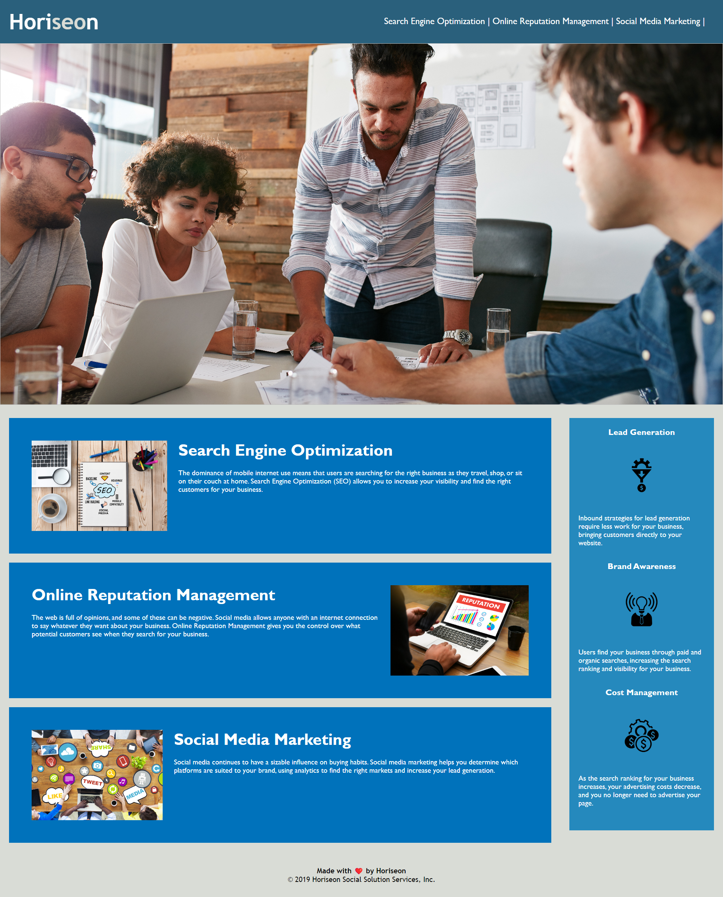

# challenge-1

## Description

This project shows the benefits of Horiseon's services, which include lead generation, brand awareness, and cost management. Providing information for each service listed above, along with relevant images and details. It has been designed to be user-friendly and meet accessibility standards, while highlighting the importance of digital marketing for businesses today. While completing this project i learned how to make a website meet accessibility standards. Learned about semantic HTML elements and how to structure the elements so they flow logically throughout. Also learned how to write a descriptive title, so it is easier found during search engine operations.

## Installation

Go view the website  https://jordanengland.github.io/challenge-1/
To view the Repository  https://github.com/JordanEngland/challenge-1


## Usage

```md
  
```
